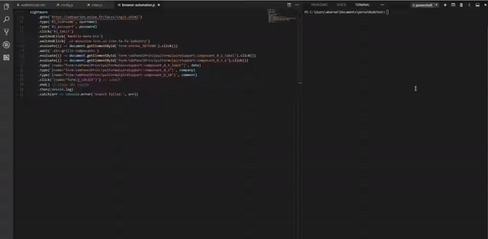

# webaurion-automation-script

Ce script concerne les personnes qui ont été admises à l'ESIEE en cycle Ingénieur par apprentissage et qui ont la flemme de renseigner une à une les entreprises pour lesquelles ils ont postulé. 

### Prérequis
- [Node.js](https://nodejs.org/fr/) doit être installé.
- Inscrire vos candidatures dans un fichier ```.csv``` (exporter depuis Excel par exemple)

Toutefois, vous aurez à le modifier si par exemple :
- vous ne candidatez pas à la filière _Réseaux et sécurité "Architecture et internet des objets" - site de Noisy-le-Grand_
- les "clés" de votre fichier ne sont pas les mêmes que les miennes.

## Utilisation
1. ```npm i``` : permet d'installer les dépendances
2. ```node index.js``` : lance le programme

Et oui c'est tout 😁... allez tchao !

## Demo


